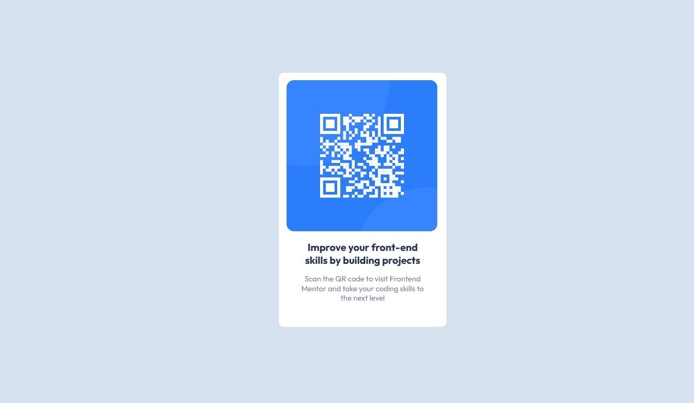

# Frontend Mentor - QR code component solution

This is my personal solution to the [QR code component challenge on Frontend Mentor](https://www.frontendmentor.io/challenges/qr-code-component-iux_sIO_H). 

## Table of contents

  - [Screenshot](#screenshot)
  - [Links](#links)
  - [Built with](#built-with)
  - [Author](#author)

### Screenshot

### Links

- Solution URL: [https://github.com/jacksen30/QR-code-component-frontend-mentor-project]
- Live Site URL: [https://qr-component-frontend-mentor-practice.netlify.app/]

### Built with

- Semantic HTML5 markup
- CSS 3 

## Author

- Website - [Jacksen Nillson](https://www.quotemkr.com)
- Frontend Mentor - [@jacksen30](https://www.frontendmentor.io/profile/jacksen30)

